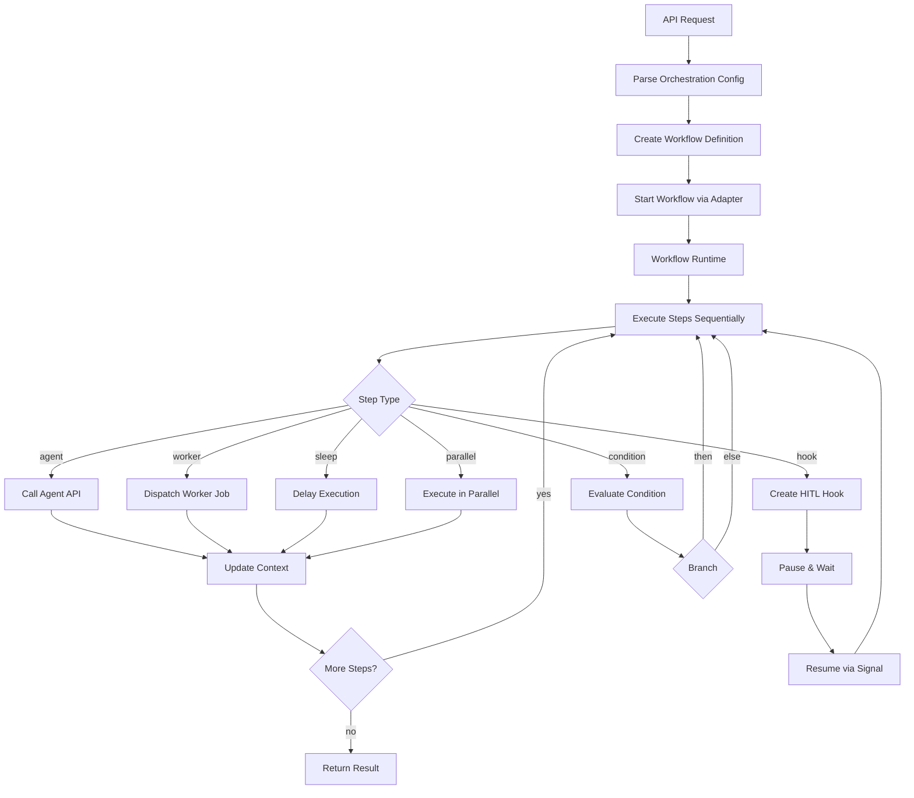
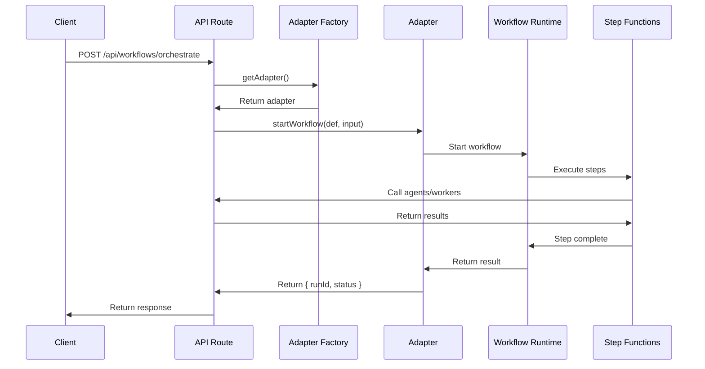
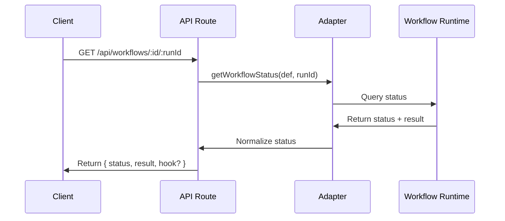
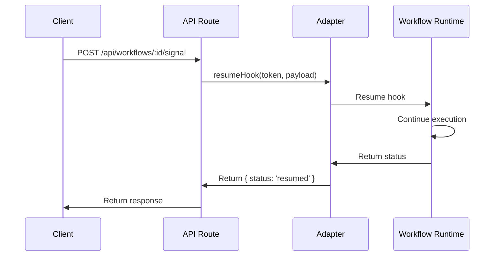

# Workflow & Orchestration Architecture

Complete guide to the workflow and orchestration system in ai-router.

## Table of Contents

1. [Developer Experience](#developer-experience)
   - [Configuration](#configuration)
   - [Basic Usage](#basic-usage)
   - [Orchestration DSL](#orchestration-dsl)
   - [API Endpoints](#api-endpoints)
   - [Code Examples](#code-examples)
2. [Internal Architecture](#internal-architecture)
   - [Package Structure](#package-structure)
   - [Runtime Adapters](#runtime-adapters)
   - [Orchestration Engine](#orchestration-engine)
   - [Data Flow](#data-flow)
   - [Provider Abstraction](#provider-abstraction)

---

## Developer Experience

### Configuration

All workflow configuration is centralized in `microfox.config.ts`:

```typescript
// microfox.config.ts
export const StudioConfig = {
  // ... other config
  workflow: {
    // Select provider: 'vercel' or 'upstash'
    provider: (process.env.WORKFLOW_PROVIDER as 'vercel' | 'upstash') || 'vercel',
    
    adapters: {
      vercel: {
        // Vercel workflow-specific config (if needed)
      },
      upstash: {
        token: process.env.QSTASH_TOKEN,
        url: process.env.QSTASH_URL,
        currentSigningKey: process.env.QSTASH_CURRENT_SIGNING_KEY,
        nextSigningKey: process.env.QSTASH_NEXT_SIGNING_KEY,
      },
    },
  },
};
```

**Environment Variables:**
- `WORKFLOW_PROVIDER`: `'vercel'` or `'upstash'` (default: `'vercel'`)
- `QSTASH_TOKEN`: Required for Upstash provider
- `QSTASH_URL`: Optional Upstash URL override
- `QSTASH_CURRENT_SIGNING_KEY`: Optional signing key for Upstash
- `QSTASH_NEXT_SIGNING_KEY`: Optional next signing key for key rotation

### Basic Usage

#### Starting a Simple Orchestration

```typescript
import { createOrchestration } from '@microfox/ai-router';

const workflow = createOrchestration()
  .agent('/research', { topic: 'AI trends' })
  .agent('/summarize', (ctx) => ({ content: ctx.previous }))
  .build();

// Execute via API
const response = await fetch('/api/workflows/orchestrate', {
  method: 'POST',
  headers: { 'Content-Type': 'application/json' },
  body: JSON.stringify({
    config: workflow,
    input: { userId: '123' },
  }),
});

const { runId, status } = await response.json();
```

#### Starting an Agent Workflow

```typescript
// Execute an agent as a workflow (with status tracking)
const response = await fetch('/api/workflows/thinker/questions', {
  method: 'POST',
  headers: { 'Content-Type': 'application/json' },
  body: JSON.stringify({
    input: { userIntent: 'What is AI?' },
    messages: [],
  }),
});

const { runId, status } = await response.json();
```

#### Checking Workflow Status

```typescript
// GET /api/workflows/:workflowId/:runId
const response = await fetch(`/api/workflows/thinker/questions/${runId}`);
const status = await response.json();
// Returns: { runId, status, result?, error?, hook? }
```

#### Sending HITL Signals

```typescript
// POST /api/workflows/:workflowId/signal
const response = await fetch('/api/workflows/my-workflow/signal', {
  method: 'POST',
  headers: { 'Content-Type': 'application/json' },
  body: JSON.stringify({
    token: 'approval:123',
    payload: { decision: 'approve', notes: 'Looks good!' },
  }),
});
```

### Orchestration DSL

The orchestration system provides a fluent builder API for defining complex workflows.

#### Orchestration Context

All steps have access to an accumulative context:

```typescript
interface OrchestrationContext {
  input: any;                       // Original workflow input
  steps: Record<string, any>;       // Outputs by step ID (ctx.steps['myStep'])
  previous: any;                    // Previous step output
  all: any[];                       // All step outputs in order
  runId?: string;                   // Current workflow runId
}
```

#### Step Types

**1. Agent Steps**

Call an AI agent (blocking or fire-and-forget):

```typescript
createOrchestration()
  // Blocking (default): wait for result
  .agent('/research', { topic: 'AI' }, { id: 'research' })
  
  // Fire-and-forget: start and continue immediately
  .agent('/notify', ctx => ctx.steps.research, { 
    await: false,
    id: 'notification' 
  })
  
  // Dynamic input using context
  .agent('/process', ctx => ({
    data: ctx.previous,
    userId: ctx.input.userId,
  }))
```

**2. Worker Steps**

Call a background worker (SQS/Lambda):

```typescript
createOrchestration()
  // Fire-and-forget (default): dispatch worker job
  .worker('video-processing', { videoUrl: '...' })
  
  // Blocking: wait for worker result
  .worker('ffprobe-analysis', ctx => ({ 
    mediaUrl: ctx.input.url 
  }), { 
    await: true,
    id: 'analysis'
  })
```

**3. Hook Steps (Human-in-the-Loop)**

Pause workflow for user input:

```typescript
createOrchestration()
  .agent('/research', { topic: 'AI' })
  .hook('approval:research', approvalSchema, { id: 'approval' })
  .agent('/publish', ctx => ({
    approved: ctx.steps.approval.decision === 'approve',
    content: ctx.steps.research,
  }))
```

**4. Sleep Steps**

Add delays between steps:

```typescript
createOrchestration()
  .agent('/collect')
  .sleep('1 hour')        // String format
  .sleep(3600000)         // Milliseconds
  .agent('/check')
```

**5. Condition Steps**

Branch execution based on context:

```typescript
createOrchestration()
  .agent('/validate', { data: '...' }, { id: 'validation' })
  .condition(
    ctx => ctx.steps.validation.valid,
    [
      // then steps
      createOrchestration()
        .agent('/process')
        .agent('/notify')
        .build().steps
    ],
    [
      // else steps
      createOrchestration()
        .agent('/handle-error')
        .build().steps
    ]
  )
```

**6. Parallel Steps**

Execute multiple steps concurrently:

```typescript
createOrchestration()
  .parallel([
    createOrchestration()
      .agent('/fetch-user')
      .build().steps[0],
    createOrchestration()
      .agent('/fetch-posts')
      .build().steps[0],
    createOrchestration()
      .agent('/fetch-comments')
      .build().steps[0],
  ])
  .agent('/combine', ctx => ({
    user: ctx.all[0],
    posts: ctx.all[1],
    comments: ctx.all[2],
  }))
```

### API Endpoints

#### Unified Workflow Routes

```
POST   /api/workflows/:workflowId          Start workflow
GET    /api/workflows/:workflowId/:runId   Get status
POST   /api/workflows/:workflowId/signal   Send HITL signal
POST   /api/workflows/orchestrate          Start orchestration
POST   /api/workflows/workers/:workerId    Execute worker
GET    /api/workflows/workers/:workerId/:jobId  Get worker status
```

#### Using the Workflow API Client

The package provides a convenient API client for making requests to these endpoints:

```typescript
import { createWorkflowClient, workflowApi } from '@microfox/ai-router';

// Option 1: Use default client with convenience functions
const { runId } = await workflowApi.startOrchestration(config);
const status = await workflowApi.getWorkflowStatus('workflow-id', runId);

// Option 2: Create a custom client with configuration
const client = createWorkflowClient({
  baseUrl: 'https://api.example.com',  // Custom base URL
  apiPath: '/api/workflows',            // Custom API path (default)
  headers: {
    'Authorization': 'Bearer token123', // Auth headers
  },
  timeout: 60000,                       // 60s timeout
});

const { runId } = await client.startOrchestration(config);

// Option 3: Configure default client globally
import { createWorkflowClient, setDefaultClient } from '@microfox/ai-router';

const client = createWorkflowClient({
  baseUrl: process.env.NEXT_PUBLIC_API_URL,
  headers: {
    'Authorization': `Bearer ${process.env.API_TOKEN}`,
  },
});
setDefaultClient(client);

// Now all workflowApi calls use this client
await workflowApi.startOrchestration(config);
```

#### Request/Response Formats

**Start Orchestration:**
```typescript
// POST /api/workflows/orchestrate
{
  config: OrchestrationConfig,  // Built with createOrchestration()
  input?: any,                  // Initial input (available as ctx.input)
  messages?: any[]              // Initial messages for agents
}

// Response
{
  runId: string,
  status: 'pending' | 'running' | 'completed' | 'failed' | 'paused',
  result?: any                  // Only if completed synchronously
}
```

**Get Status:**
```typescript
// GET /api/workflows/:workflowId/:runId
// Response
{
  runId: string,
  status: string,
  result?: any,
  error?: string,
  hook?: {
    token: string,
    type: 'hook'
  }
}
```

**Send Signal:**
```typescript
// POST /api/workflows/:workflowId/signal
{
  token: string,     // Hook token
  payload: any       // Data to resume with
}

// Response
{
  status: 'resumed',
  message: 'Hook resumed successfully'
}
```

**Using the API Client:**

All endpoints have corresponding client functions:

```typescript
import { workflowApi, createWorkflowClient } from '@microfox/ai-router';

// Start workflow
const { runId, status } = await workflowApi.startWorkflow(
  'workflow-id',
  { input: 'data' },
  { messages: [...] }
);

// Get status
const status = await workflowApi.getWorkflowStatus('workflow-id', runId);

// Send signal
await workflowApi.sendSignal('workflow-id', token, payload);

// Start orchestration
const { runId } = await workflowApi.startOrchestration(config, {
  input: {...},
  messages: [...]
});

// Execute worker
const { jobId } = await workflowApi.executeWorker('worker-id', input, {
  await: false
});

// Get worker status
const job = await workflowApi.getWorkerStatus('worker-id', jobId);

// Custom client configuration
const client = createWorkflowClient({
  baseUrl: 'https://api.example.com',
  headers: { 'Authorization': 'Bearer token' },
  timeout: 60000,
});
```

### Code Examples

#### Example 1: Research & Approval Workflow

```typescript
import { createOrchestration, workflowApi } from '@microfox/ai-router';
import { z } from 'zod';

const approvalSchema = z.object({
  decision: z.enum(['approve', 'reject']),
  notes: z.string().optional(),
});

const researchWorkflow = createOrchestration()
  .agent('/research', (ctx) => ({ 
    topic: ctx.input.topic,
    userId: ctx.input.userId 
  }), { id: 'research' })
  .hook(
    (ctx) => `approval:${ctx.input.userId}:${ctx.input.topic}`,
    approvalSchema,
    { id: 'approval' }
  )
  .condition(
    (ctx) => ctx.steps.approval.decision === 'approve',
    [
      createOrchestration()
        .agent('/publish', (ctx) => ({
          content: ctx.steps.research,
          approvedBy: ctx.steps.approval.notes,
        }))
        .agent('/notify', (ctx) => ({
          userId: ctx.input.userId,
          message: 'Your research has been published!',
        }))
        .build().steps
    ],
    [
      createOrchestration()
        .agent('/notify', (ctx) => ({
          userId: ctx.input.userId,
          message: 'Your research was rejected.',
        }))
        .build().steps
    ]
  )
  .build();

// Execute using the workflow API client
const { runId } = await workflowApi.startOrchestration(researchWorkflow, {
  input: {
    userId: 'user-123',
    topic: 'AI Ethics',
  },
});

// Later, approve the research
await workflowApi.sendSignal('orchestrate', `approval:user-123:AI Ethics`, {
  decision: 'approve',
  notes: 'Excellent work!',
});
```

#### Example 2: Video Processing Pipeline

```typescript
import { createOrchestration } from '@microfox/ai-router';

const videoPipeline = createOrchestration()
  // Analyze video metadata (worker)
  .worker('ffprobe-analysis', (ctx) => ({
    mediaUrl: ctx.input.videoUrl,
    maxBytes: 8 * 1024 * 1024,
  }), { 
    await: true,
    id: 'metadata' 
  })
  // Process based on metadata
  .condition(
    (ctx) => ctx.steps.metadata.summary.hasVideo,
    [
      createOrchestration()
        .agent('/extract-thumbnail', (ctx) => ({
          videoUrl: ctx.input.videoUrl,
          timestamp: ctx.steps.metadata.summary.durationSec / 2,
        }))
        .worker('video-converter', (ctx) => ({
          inputUrl: ctx.input.videoUrl,
          format: 'mp4',
          quality: 'high',
        }), { await: false })
        .build().steps
    ],
    [
      createOrchestration()
        .agent('/handle-audio-only')
        .build().steps
    ]
  )
  .agent('/finalize', (ctx) => ({
    metadata: ctx.steps.metadata,
    processed: true,
  }))
  .build();
```

#### Example 3: Scheduled Data Collection

```typescript
const dataCollectionWorkflow = createOrchestration()
  .parallel([
    createOrchestration()
      .agent('/fetch-users')
      .build().steps[0],
    createOrchestration()
      .agent('/fetch-orders')
      .build().steps[0],
    createOrchestration()
      .agent('/fetch-products')
      .build().steps[0],
  ])
  .agent('/combine-data', (ctx) => ({
    users: ctx.all[0],
    orders: ctx.all[1],
    products: ctx.all[2],
  }), { id: 'combined' })
  .agent('/analyze', (ctx) => ctx.steps.combined)
  .sleep('1 day')
  .agent('/generate-report', (ctx) => ({
    analysis: ctx.previous,
    date: new Date().toISOString(),
  }))
  .build();
```

#### Example 4: Agent as Workflow

```typescript
import { workflowApi } from '@microfox/ai-router';

// Execute a single agent with workflow benefits (status tracking, resumability)
const { runId, status } = await workflowApi.startWorkflow(
  '/thinker/questions',
  {
    userIntent: 'Explain quantum computing',
  },
  {
    messages: [
      { role: 'user', content: 'I want to learn about quantum computing' },
    ],
  }
);

// Poll for status
const { status: currentStatus, result } = await workflowApi.getWorkflowStatus(
  '/thinker/questions',
  runId
);
```

#### Example 5: Worker in Orchestration

```typescript
// Register worker (in your worker file or registry)
import { registerWorker } from '@/app/api/workflows/workers/[...slug]/route';
import { myWorker } from '@/app/ai/agents/my-worker';

registerWorker(myWorker.id, async () => myWorker);

// Use in orchestration
const workflow = createOrchestration()
  .agent('/prepare', { data: '...' }, { id: 'prepared' })
  .worker('my-worker-id', (ctx) => ctx.steps.prepared, { 
    await: true,
    id: 'processed'
  })
  .agent('/finalize', (ctx) => ctx.steps.processed)
  .build();
```

### Provider Comparison

| Feature | Vercel `workflow` | Upstash Workflow |
|---------|------------------|------------------|
| **Max Duration** | 60s (Hobby) / 5min (Pro) / 15min (Enterprise) per step | **Unlimited** (can run for days/weeks) |
| **Cost Model** | Pay for execution time | Pay per step/message |
| **Sleep/Wait** | Function stays running (pays for time) | Function shuts down ($0 while waiting) |
| **Long-running Tasks** | Limited by function timeout | Unlimited via `context.call` + `waitForEvent` |
| **Human-in-the-Loop** | `defineHook().create()` | `context.waitForEvent()` |
| **Best For** | Fast, synchronous workflows | Long-running, multi-day workflows |

**Switching Providers:**

Simply change `WORKFLOW_PROVIDER` in your `.env` or `microfox.config.ts`:

```typescript
// microfox.config.ts
workflow: {
  provider: 'upstash',  // or 'vercel'
  // ...
}
```

The same orchestration DSL works with both providers - no code changes needed!

---

## Internal Architecture

### Package Structure

```
packages/ai-router/src/workflow/
├── index.ts              # Main exports (all workflow types)
├── types.ts              # Core types (WorkflowDefinition)
├── config.ts             # Configuration loader
├── orchestrate.ts        # Orchestration DSL types & builder
└── runtimeAdapter.ts     # Adapter interface (no implementations)

examples/root/app/api/workflows/
├── [...slug]/route.ts           # Unified workflow router
├── orchestrate/
│   ├── route.ts                 # Orchestration endpoint
│   └── upstash/route.ts         # Upstash orchestration implementation
├── workers/
│   └── [...slug]/route.ts       # Worker execution endpoint
├── workflows/
│   ├── orchestrateWorkflow.ts   # Vercel orchestration function
│   ├── agentWorkflow.ts         # Agent workflow function
│   └── steps.ts                 # Step execution helpers
└── adapters/
    ├── index.ts                 # Adapter factory
    ├── vercelAdapter.ts         # Vercel adapter implementation
    ├── upstashAdapter.ts        # Upstash adapter implementation
    └── helpers.ts               # Workflow definition helpers
```

### Design Principles

1. **Provider Agnostic**: Package exports only interfaces/types, no implementations
2. **Boilerplate Implementations**: Adapters live in boilerplate to avoid dependency bloat
3. **Unified API**: Single routing structure regardless of provider
4. **Type Safe**: Full TypeScript support with Zod validation
5. **Composable**: Orchestration DSL supports complex flows

### Runtime Adapters

Adapters bridge the gap between ai-router's orchestration system and specific workflow providers.

#### Adapter Interface

```typescript
interface WorkflowRuntimeAdapter {
  // Start a workflow instance
  startWorkflow<Input, Output>(
    def: any,
    input: Input
  ): Promise<WorkflowRuntimeStartResult<Output>>;

  // Get workflow status
  getWorkflowStatus<Output>(
    def: any,
    runId: string
  ): Promise<WorkflowRuntimeStatusResult<Output>>;

  // Resume HITL hook
  resumeHook<Payload, Output>(
    token: string,
    payload: Payload
  ): Promise<WorkflowRuntimeStatusResult<Output>>;

  // Resume webhook
  resumeWebhook<Payload, Output>(
    token: string,
    payload: Payload
  ): Promise<WorkflowRuntimeStatusResult<Output>>;
}
```

#### Vercel Adapter

Uses `workflow/api` from Vercel's workflow runtime:

```typescript
// examples/root/app/api/workflows/adapters/vercelAdapter.ts
import { start, getRun, resumeHook, resumeWebhook } from 'workflow/api';

export const vercelWorkflowAdapter: WorkflowRuntimeAdapter = {
  async startWorkflow(def, input) {
    const workflowFn = def?.workflowFn;
    const run = await start(workflowFn, [input]);
    return {
      runId: run.runId,
      status: await run.status,
      result: status === 'completed' ? await run.returnValue : undefined,
    };
  },
  // ... other methods
};
```

#### Upstash Adapter

Uses `@upstash/workflow` Client SDK:

```typescript
// examples/root/app/api/workflows/adapters/upstashAdapter.ts
import { Client } from '@upstash/workflow';

export const upstashWorkflowAdapter: WorkflowRuntimeAdapter = {
  async startWorkflow(def, input) {
    const client = new Client({ token: config.adapters.upstash.token });
    const { workflowRunId } = await client.trigger({
      url: def.endpointUrl,
      body: input,
    });
    return { runId: workflowRunId, status: 'running' };
  },
  // ... other methods
};
```

#### Adapter Factory

The factory selects the appropriate adapter based on configuration:

```typescript
// examples/root/app/api/workflows/adapters/index.ts
export function getAdapter(): WorkflowRuntimeAdapter {
  const config = getWorkflowConfig();
  
  switch (config.provider) {
    case 'vercel':
      return vercelWorkflowAdapter;
    case 'upstash':
      return upstashWorkflowAdapter;
  }
}
```

### Orchestration Engine

#### Execution Flow



#### Context Management

The orchestration engine maintains an accumulative context throughout execution:

```typescript
interface OrchestrationContext {
  input: any;                       // Original input (immutable)
  steps: Record<string, any>;       // Named step outputs (ctx.steps['myStep'])
  previous: any;                    // Previous step output
  all: any[];                       // All outputs in order
  runId?: string;                   // Workflow run ID
}
```

**Example Context Evolution:**

```typescript
// Initial
{ input: { userId: '123' }, steps: {}, previous: null, all: [] }

// After agent step with id='research'
{ 
  input: { userId: '123' },
  steps: { research: { topic: 'AI', summary: '...' } },
  previous: { topic: 'AI', summary: '...' },
  all: [{ topic: 'AI', summary: '...' }]
}

// After hook step with id='approval'
{
  input: { userId: '123' },
  steps: { 
    research: {...},
    approval: { decision: 'approve' }
  },
  previous: { decision: 'approve' },
  all: [{...}, { decision: 'approve' }]
}
```

#### Step Execution

Each step type has a dedicated handler:

**Agent Step:**
- Resolves input (static or function)
- Calls agent API endpoint
- Extracts result from UIMessage array
- Updates context

**Worker Step:**
- Resolves input
- Dispatches worker via `/api/workflows/workers/:id`
- If `await: true`, polls or uses webhook for result
- Updates context

**Hook Step:**
- Resolves token (static or function)
- Creates hook using provider API (`defineHook()` or `waitForEvent()`)
- Pauses workflow execution
- Resumes when signal received

**Condition Step:**
- Evaluates condition function with context
- Executes `then` or `else` branch
- Results merged into main context

**Parallel Step:**
- Executes all steps concurrently
- Waits for all to complete
- Merges results into context

**Sleep Step:**
- Delays execution using provider API (`sleep()` or `context.sleep()`)

### Data Flow

#### Request Flow



#### Status Polling Flow



#### HITL Signal Flow



### Provider Abstraction

The system abstracts differences between providers:

#### Normalized Status

Providers use different status values, but adapters normalize them:

```typescript
// Vercel: "pending" | "running" | "completed" | "failed" | "paused"
// Upstash: "RUN_STARTED" | "RUN_SUCCESS" | "RUN_FAILED" | "RUN_CANCELED"

// Normalized: "pending" | "running" | "completed" | "failed" | "cancelled" | "paused"
```

#### Workflow Definitions

Different providers need different metadata:

**Vercel:**
```typescript
{
  id: 'my-workflow',
  provider: 'vercel',
  definition: {
    workflowFn: async (input) => { "use workflow"; /* ... */ }
  }
}
```

**Upstash:**
```typescript
{
  id: 'my-workflow',
  provider: 'upstash',
  definition: {
    endpointUrl: 'https://app.com/api/workflows/orchestrate/upstash'
  }
}
```

Adapters handle these differences internally.

#### Step Execution Differences

**Vercel (using `"use workflow"` directive):**
```typescript
async function orchestrateWorkflowFn(input) {
  "use workflow";
  
  const result = await callAgentStep({ ... });
  await sleep('1 hour');
  const hook = defineHook({ schema }).create({ token });
  const payload = await hook;
}
```

**Upstash (using `serve()` wrapper):**
```typescript
export const { POST } = serve(async (context) => {
  const result = await context.call('agent-step', { ... });
  await context.sleep('1 hour');
  const { eventData } = await context.waitForEvent('hook-token');
});
```

The orchestration engine provides a unified DSL that works with both.

### Configuration System

#### Configuration Loader

The config loader (`packages/ai-router/src/workflow/config.ts`) provides:

1. **Config Provider Pattern**: Boilerplate sets provider function
2. **Environment Fallback**: Falls back to env vars if config unavailable
3. **Caching**: Config cached for performance

```typescript
// In adapter factory (boilerplate)
import { StudioConfig } from '@/microfox.config';
setWorkflowConfigProvider(() => StudioConfig.workflow);

// Later, anywhere in code
import { getWorkflowConfig } from '@microfox/ai-router';
const config = getWorkflowConfig();
```

### Worker Integration

Workers are integrated through a unified endpoint:

#### Worker Registration

Workers can be registered explicitly:

```typescript
import { registerWorker } from '@/app/api/workflows/workers/[...slug]/route';
import { myWorker } from '@/app/ai/agents/my-worker';

registerWorker(myWorker.id, async () => myWorker);
```

#### Worker Execution

When a worker step is executed:

1. Orchestration calls `/api/workflows/workers/:workerId`
2. Worker endpoint looks up worker in registry
3. Worker is dispatched via `worker.dispatch()`
4. If `await: true`, workflow waits for webhook callback
5. Result is returned to orchestration context

#### Worker Step Implementation

```typescript
case 'worker': {
  const workerInput = resolveInput(step.input, context);
  
  if (step.await === false) {
    // Workers only support fire-and-forget mode
    // Workers are long-running background tasks that complete independently
    const result = await callWorkerStep({ workerId, workerInput, baseUrl });
    return { jobId: result.jobId, status: 'queued' };
}
```

### Error Handling

Errors are propagated through the workflow system:

1. **Step Execution Errors**: Thrown and caught by workflow runtime
2. **Adapter Errors**: Wrapped with provider-specific context
3. **Validation Errors**: Zod schemas validate inputs before execution
4. **Provider Errors**: Mapped to normalized error format

All errors are returned in the status response:

```typescript
{
  status: 'failed',
  error: 'Error message here',
  // ...
}
```

### Best Practices

1. **Use Step IDs**: Always provide `id` for steps you need to reference later
2. **Type Safety**: Use Zod schemas for input validation
3. **Deterministic Tokens**: Generate hook tokens from context data
4. **Provider Selection**: Choose provider based on workflow duration needs
5. **Error Handling**: Handle errors at the orchestration level
6. **Testing**: Test workflows locally before deploying

### Extension Points

The architecture supports extension:

1. **Custom Adapters**: Implement `WorkflowRuntimeAdapter` for new providers
2. **Custom Steps**: Add new step types to `OrchestrationStep` union
3. **Step Handlers**: Implement step execution in workflow functions
4. **Worker Registry**: Extend worker discovery/registration system

---

## Summary

The workflow architecture provides:

- **Simple Configuration**: Single config file controls everything
- **Unified API**: Same endpoints work with any provider
- **Rich DSL**: Powerful orchestration language for complex flows
- **Type Safety**: Full TypeScript support throughout
- **Provider Agnostic**: Switch providers without code changes
- **Worker Integration**: Seamless integration with background workers
- **Developer Friendly**: Fluent API with clear error messages

The system balances simplicity with power, allowing developers to build sophisticated multi-agent workflows while maintaining clean, maintainable code.
